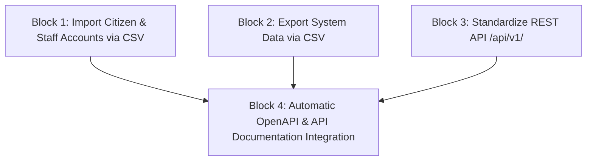

# Feature Tasks: F08 - Import/Export & API Documentation

**Branch**: `task/98887-import-export-api-documentation` | **Spec**: [spec.md](file:///c:/Users/sf/Documents/GitHub/nhom3_php_naitei_26/specs/98887-import-export-api-documentation/spec.md) | **Plan**: [plan.md](file:///c:/Users/sf/Documents/GitHub/nhom3_php_naitei_26/specs/98887-import-export-api-documentation/plan.md)

---

## Phase 1: Import Citizen & Staff Accounts via CSV

**Goal**: Allow Admin to upload a CSV file containing Citizen or Staff lists, validate each row, and save valid records to the database with a detailed error report for invalid rows.

**Independent Test**: Admin uploads a CSV file with 3 valid rows and 2 invalid rows (duplicate CCCD, invalid email). The system successfully imports 3 accounts and returns a report listing the 2 failed rows with exact line numbers and reasons.

### Implementation Tasks for User Story 1

- [x] T001 [P] [US1] Create CsvImportService with CSV header parsing and UTF-8 BOM removal in `app/Services/CsvImportService.php`
- [x] T002 [P] [US1] Implement Citizen row-by-row validation rules (email, 12-digit citizen_id unique check) in `app/Services/CsvImportService.php`
- [x] T003 [P] [US1] Implement Staff row-by-row validation rules (email, department_id exists, role check) in `app/Services/CsvImportService.php`
- [x] T004 [P] [US1] Create CsvImportRequest for CSV file validation in `app/Http/Requests/Admin/CsvImportRequest.php`
- [x] T005 [US1] Create UserImportController and register routes in `app/Http/Controllers/Admin/UserImportController.php` and `routes/web.php`
- [x] T006 [US1] Implement database transaction batch insert and error report payload construction in `app/Services/CsvImportService.php`
- [x] T007 [US1] Create Admin Import Blade view with file picker and error report table in `resources/views/admin/users/import.blade.php`
- [x] T008 [US1] Add "Import CSV" buttons and modal triggers on Admin User & Staff list pages in `resources/views/admin/users/index.blade.php`
- [x] T009 [P] [US1] Add Activity Log audit records for CSV Import actions in `app/Services/CsvImportService.php`
- [x] T010 [P] [US1] Create Feature tests for Citizen and Staff CSV import in `tests/Feature/Admin/UserImportTest.php`

---

## Phase 2: Export System Data via CSV

**Goal**: Allow Admin to export lists of Citizens, Applications, Services, Departments, and Staff to CSV files respecting current search filters and supporting Vietnamese characters.

**Independent Test**: Apply status filter "processing" on Applications, click Export CSV, and verify the generated file contains only matching records with correct UTF-8 encoding.

### Implementation Tasks for User Story 2

- [x] T011 [P] [US2] Create CsvExportService with streamed response generator and UTF-8 BOM output in `app/Services/CsvExportService.php`
- [x] T012 [P] [US2] Implement filter-aware query exporters for Citizens, Applications, Services, Departments, Staff in `app/Services/CsvExportService.php`
- [x] T013 [P] [US2] Create DataExportRequest for query filter validation in `app/Http/Requests/Admin/DataExportRequest.php`
- [x] T014 [US2] Create DataExportController and register routes in `app/Http/Controllers/Admin/DataExportController.php` and `routes/web.php`
- [x] T015 [US2] Add "Export CSV" buttons with active filter binding on Admin list views in `resources/views/admin/applications/index.blade.php`, `resources/views/admin/users/index.blade.php`, `resources/views/admin/departments/index.blade.php`, and `resources/views/admin/service-types/index.blade.php`
- [x] T016 [P] [US2] Add Activity Log audit records for CSV Export actions in `app/Services/CsvExportService.php`
- [x] T017 [P] [US2] Create Feature tests for CSV data export in `tests/Feature/Admin/DataExportTest.php`

---

## Phase 3: Standardize REST API /api/v1/

**Goal**: Standardize all responses under `/api/v1/` to use a uniform JSON envelope (`success`, `message`, `data`/`errors`).

**Independent Test**: Request API `/api/v1/services` and `/api/v1/applications`, verifying consistent JSON envelope structure and accurate HTTP status codes (200, 401, 403, 422).

### Implementation Tasks for User Story 3

- [x] T018 [P] [US3] Create standardized ApiResponse helper/trait in `app/Http/Responses/ApiResponse.php`
- [x] T019 [P] [US3] Update JsonResource definitions to format data envelopes in `app/Http/Resources/Api/V1/`
- [x] T020 [US3] Refactor API Controllers to return standardized envelope responses in `app/Http/Controllers/Api/V1/`
- [x] T021 [US3] Enforce Sanctum Bearer token and Policy authorization middleware checks on API endpoints in `routes/api.php`
- [x] T022 [P] [US3] Create Feature tests for REST API envelope standardization and security in `tests/Feature/Api/ApiV1StandardizationTest.php`

---

## Phase 4: Automatic OpenAPI & API Documentation Integration

**Goal**: Integrate `dedoc/scramble` to automatically generate and display interactive OpenAPI/Swagger documentation at route `/docs/api`.

**Independent Test**: Navigate to `/docs/api`, verify the Swagger/Scramble interface loads successfully displaying all `/api/v1/` endpoints.

### Implementation Tasks for User Story 4

- [x] T023 [P] [US4] Configure `dedoc/scramble` package and route settings in `config/scramble.php`
- [x] T024 [US4] Register `/docs/api` route and authorization gate in `app/Providers/AppServiceProvider.php` (allow public access in local/staging, restrict to Admin role in production)
- [x] T025 [P] [US4] Add PHPDoc and Request annotations to API Controllers in `app/Http/Controllers/Api/V1/`
- [x] T026 [P] [US4] Create Feature tests for API Documentation endpoint availability in `tests/Feature/Api/ApiDocsTest.php`
- [x] T027 Execute Backend & Frontend linters (`composer run lint` and `npm run lint`)
- [x] T028 Execute end-to-end quickstart validation scenarios from `specs/98887-import-export-api-documentation/quickstart.md`

---

## 🔄 Dependencies & Execution Order

